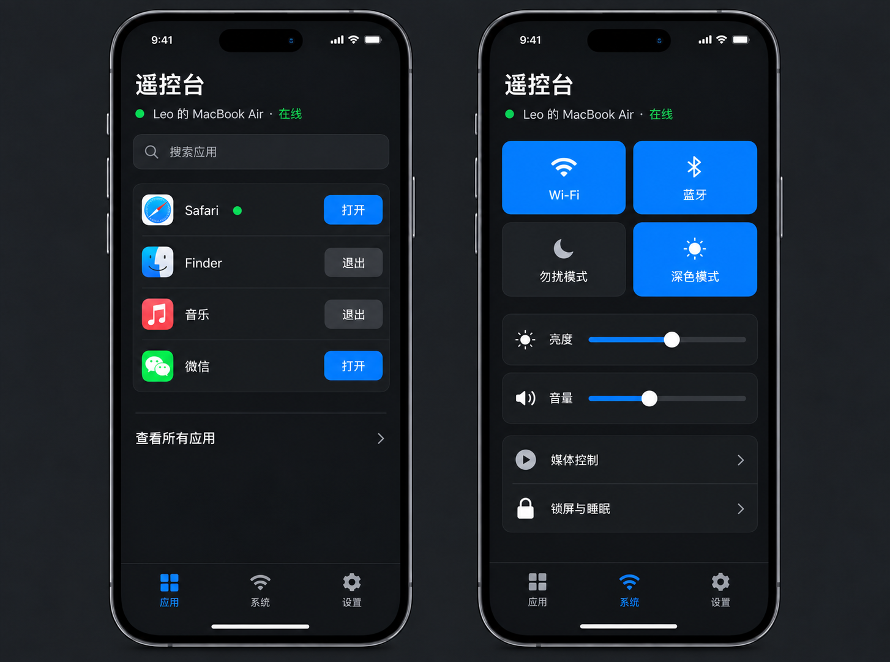

# 遥控台

用手机浏览器控制自己的 Mac：查看和搜索应用、打开与退出应用、调节音量，以及使用系统控制。项目由移动端 PWA、Node 22 中继和 Swift 菜单栏代理组成。当前仓库只提供本地可复现的实现；没有部署到 `control.dkz12345.com`。



## 本地启动

需要 macOS 14+、Node 22、npm 10+、Xcode、[XcodeGen](https://github.com/yonaskolb/XcodeGen)。Swift 项目通过 XcodeGen 生成，并锁定 Sparkle 2.9.2。开发配置使用 `http://localhost:3300` 和 WebAuthn RP ID `localhost`；生产配置固定为 `https://control.dkz12345.com`。

```sh
cd /Users/leo/Documents/Codex/2026-09-12/mac/work/yaokongtai
npm ci
npm run build
cp .env.example .env
# 在 .env 中设置至少 32 字符的 SESSION_SECRET 和随机 BOOTSTRAP_TOKEN
set -a; source .env; set +a
npm run dev
```

打开 `http://localhost:3300`，输入 `.env` 中的引导令牌，注册 Passkey，并把一次性恢复码保存到仓库以外。开发用途可使用 `scripts/use-node22.sh npm ...` 强制选择本机 Node 22。不要把 `.env`、恢复码或数据库提交到 Git。

另开终端生成和测试 Mac 代理：

```sh
npm run mac:generate
npm run mac:test
npm run mac:build
```

签名后的测试 App 位于 `outputs/遥控台代理.app`，不被 Git 跟踪。直接运行调试版或从网页生成配对码后在菜单栏代理中输入。代理仅向中继发起出站 WebSocket 连接；浏览器收到代理快照后才会启用控制。停止代理会立即显示离线，命令不会排队。代理的设备私钥保存在登录钥匙串；重新启动代理仍可保持配对。生产版安装与登录启动不是本仓库构建步骤的一部分。

## 操作范围

命令是固定协议，不提供 Shell、任意路径、URL、屏幕、文件或文本输入。应用操作只接受当前代理登记的 Bundle ID；Finder、Dock、控制中心、loginwindow 与代理本身受到退出保护。强制退出、关闭 Wi‑Fi、锁屏和睡眠先显示确认面板，再要求与具体命令绑定的一次性 Passkey 验证。提权令牌 60 秒后失效。会话最长 7 天，审计记录 30 天清理。

系统能力与权限见 [权限和兼容表](docs/PERMISSIONS.md)，安全边界见 [安全说明](docs/SECURITY.md)，数据流见 [架构说明](docs/ARCHITECTURE.md)，已完成和待补的检查见 [本地验证记录](docs/VALIDATION.md)。缺少相关 macOS 权限时对应控制显示不可用；其他控制可继续使用。显示器不支持亮度读取时亮度滑杆显示“—”。勿扰模式依赖两条固定名称的本地快捷指令，需要自行创建。

## 验证与部署模板

```sh
npm run typecheck
npm test
npm run build
npm run lint:secrets
npm audit --omit=dev --audit-level=high
npm run deploy:dry-run
```

`.github/workflows/ci.yml` 在 GitHub 上执行 Node 和 Swift 检查。部署脚本 `scripts/install-release.sh` 默认只接受 `--dry-run` 或显式 `--deploy`；后者要求干净且已推送的提交，并额外要求 `ALLOW_PRODUCTION_DEPLOY=yes`。本轮只运行 dry-run。`deploy/` 仅含 Nginx 与 systemd 模板，不会自动修改服务器。Sparkle Release Feed 预设生产地址，Debug Feed 指向 localhost；签名私钥只存于本机钥匙串，仓库仅含公钥。

## 许可

MIT，见 [LICENSE](LICENSE)。
