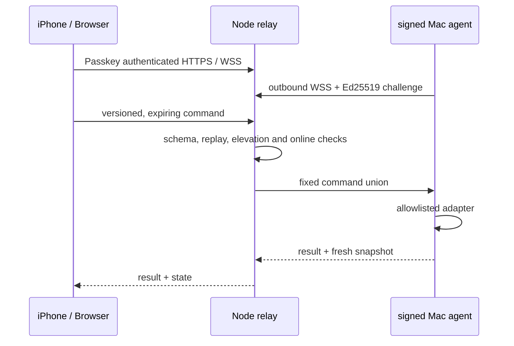

# Architecture

The relay never exposes a shell or accepts an application path. Application commands use bundle identifiers from the agent's most recent inventory. Commands expire after ten seconds and are never queued while the agent is offline.

## Authentication

- Browsers use WebAuthn passkeys. Session cookies are opaque, hashed at rest, `HttpOnly`, `SameSite=Strict`, and valid for seven days.
- A one-time bootstrap token can register only the first administrator.
- Recovery codes are scrypt hashed and single use.
- Force quit, Wi-Fi off, lock and sleep require a WebAuthn assertion bound to the exact command. The resulting token expires after 60 seconds and is consumed once.
- The Mac stores an Ed25519 private key in the login Keychain. The relay stores only its public key.

## Persistence

SQLite stores authentication metadata, public device keys, sessions, favorites and minimal audit events. Live snapshots stay in memory; the current agent sends application names and states without icons, so the web client shows letter placeholders. Audit cleanup runs every 10 seconds and removes events older than 30 days.

## Protocol compatibility

Every command and snapshot carries `protocolVersion`. The current relay accepts version 1 only. A future incompatible protocol must add a compatibility window before updating agents.
